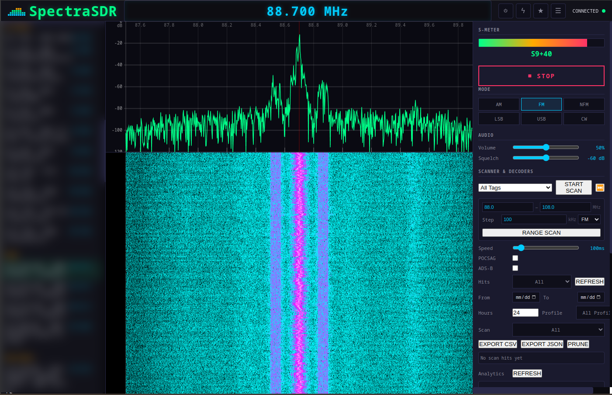

# SpectraSDR

SpectraSDR is a software-defined radio receiver for RTL-SDR hardware exposed
through `rtl_tcp`. It provides a browser-based spectrum and waterfall, audio
demodulation, scanning, recording, and decoder plugins. The same interface can
run in a normal browser or in the optional Electron desktop shell.



## Features

- Live spectrum and waterfall displays.
- WBFM, NFM, AM, USB, and LSB demodulation.
- Demodulated WAV recording and raw IQ capture.
- Bookmark and frequency-range scanning.
- SQLite scan history, filters, analytics, and CSV/JSON export.
- Decoder plugins with runtime discovery and health reporting.
- POCSAG decoding with BCH(31,21) error correction.
- ADS-B ingestion through `dump1090`, including an aircraft list and map.
- Saved RTL-TCP connection profiles.
- Browser and Linux AppImage launch options.

## Requirements

- Python 3.10 or newer.
- An RTL-SDR device reachable through `rtl_tcp`.
- Node.js and npm only when using or building the Electron shell.
- `dump1090` only when using live ADS-B decoding.

## Run from source

Create an environment and install the Python dependencies:

```bash
git clone https://github.com/EvalAlan/SpectraSDR.git
cd SpectraSDR
python -m venv .venv
source .venv/bin/activate
python -m pip install -r requirements.txt
```

Start `rtl_tcp` locally, or configure the address of an existing instance:

```bash
rtl_tcp -a 127.0.0.1 -p 1234
```

The backend has working defaults. To customize them, copy the example first:

```bash
cp src/backend/config.json.example src/backend/config.json
```

Start SpectraSDR:

```bash
python src/backend/server.py
```

Open <http://localhost:5555>. The backend serves the frontend and listens for
its WebSocket connection on port `8765`.

The bundled frontend currently connects to WebSocket port `8765` directly.
The Electron shell also expects HTTP port `5555`, so keep both defaults when
using the desktop app.

## Desktop app

The Electron shell starts the Python backend and opens the UI in a desktop
window:

```bash
cd electron-app
npm install
npm start
```

For packaging and AppImage instructions, see
[electron-app/README.md](electron-app/README.md).

## Configuration and data

When the backend is run directly, configuration defaults to `src/backend/`
and recordings default to `recordings/` at the repository root. Files created
there are ignored by Git.

The Electron and AppImage launchers use an application data directory instead
so upgrades do not overwrite settings, bookmarks, connection profiles,
recordings, or scan history. The exact parent directory is platform-specific
and comes from Electron's `app.getPath("userData")`.

Every backend path can be overridden with an environment variable:

| Setting | Environment variable |
| --- | --- |
| Main configuration | `SPECTRASDR_CONFIG_FILE` |
| Bookmarks | `SPECTRASDR_BOOKMARKS_FILE` |
| Connection profiles | `SPECTRASDR_CONNECTIONS_FILE` |
| Recordings directory | `SPECTRASDR_RECORDINGS_DIR` |
| Scan-history database | `SPECTRASDR_SCAN_HITS_DB` |
| Shared application data directory | `SPECTRASDR_DATA_ROOT` |

The default radio, HTTP, and WebSocket settings are documented in
[`config.json.example`](src/backend/config.json.example). The old `EVILSDR_`
environment prefix remains available as a migration fallback; `SPECTRASDR_`
wins when both are set.

## ADS-B

Set the command used to start `dump1090`, then enable the ADS-B decoder in the
Plugins settings:

```bash
export SPECTRASDR_DUMP1090_CMD='dump1090 --net --quiet --write-json /tmp/d1090'
python src/backend/server.py
```

Without this variable, the ADS-B plugin still loads but has no live subprocess
input.

## Development

Install the runtime dependencies plus the development tools, then run the
Python and Electron tests:

```bash
python -m pip install -r requirements.txt
python -m pip install pytest ruff
pytest tests -q
ruff check src tests
cd electron-app && npm test
```

Repository layout:

| Path | Purpose |
| --- | --- |
| `src/backend/` | Python server, RTL-TCP client, DSP, scanner, and persistence |
| `src/backend/decoders/` | Decoder API, plugin manager, POCSAG, and ADS-B |
| `src/frontend/` | Static HTML, CSS, canvas visualizations, and browser client |
| `electron-app/` | Electron launcher and packaging metadata |
| `tests/` | Python unit and regression tests |
| `docs/` | Architecture, operations, plugin, and historical planning docs |
| `scripts/` | Release and AppImage tooling |

For implementation details, see [Architecture](docs/ARCHITECTURE.md). For
operations and release checks, see the [Runbook](docs/RUNBOOK.md). The
[documentation index](docs/README.md) lists the remaining guides.

## Current status

The core receiver, scanner, recording paths, plugin framework, POCSAG decoder,
ADS-B integration, map, and scan analytics are implemented. Current known
areas for further work include more robust POCSAG polarity/bit slicing and an
experimental TV/ATV decoder path.

See the current [roadmap](docs/ROADMAP.md) for planned engineering work and
known integration gaps.
